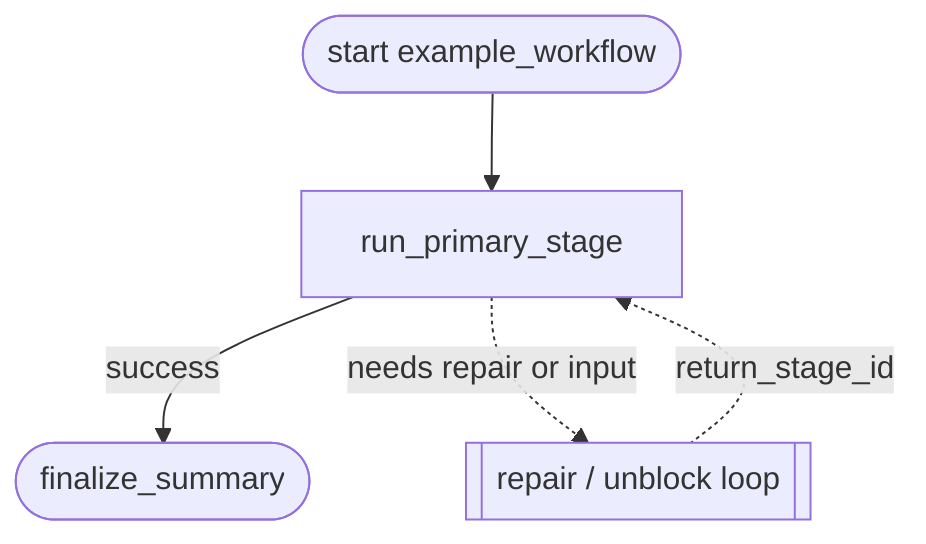

# example_workflow Flowchart

Developer-facing overview for `example_workflow`.

When copying this skeleton, update this file together with `policy.py` and
`graphbuilder_runtime.py`. Keep the diagram focused on the workflow's global
shape; put repetitive failure details in notes instead of drawing every edge.
The diagram shows the route; the table below explains what each stage does.

## Stage Responsibilities

| Stage | Does | Produces | Done when |
|---|---|---|---|
| `run_primary_stage` | Replace this with the primary business responsibility of the workflow. | primary business-stage artifact | The stage contract, verifier, and workflow-specific gates pass. |
| `finalize_summary` | Prepare the final workflow summary and handoff. | Final workflow summary or handoff artifact. | Previous business stage completed successfully. |

## Maintenance Notes

- Replace `example_workflow` with the real `workflow_id`.
- Replace node names after changing step IDs in `policy.py` or
  `graphbuilder_runtime.py`.
- Keep `return_stage_id` fallback aligned with `policy.py`.
- If you add workflow-specific gates that change the global route, add them to
  the diagram.
- Do not expand the common `blocked`, `partial`, `failed`, and verifier-failed
  handling for every node unless the workflow is specifically about repair
  policy.
