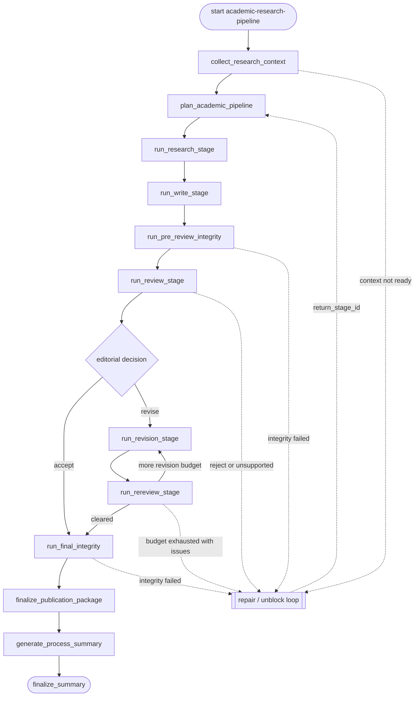

# academic-research-pipeline Flowchart

Developer-facing overview for `academic-research-pipeline`.

Derived from:

- `policy.py`
- `graphbuilder_runtime.py`

This document is informational only. `policy.py` remains the runtime source of
truth, and host agents must not choose branches from this diagram.

Durable academic pipeline for research, writing, integrity gates, review,
revision, re-review, final integrity, publication packaging, and process
summary.

## Global Flow

## Policy Notes

- The diagram shows the publication pipeline, not every start-stage alias.
  `plan_academic_pipeline` can still jump into supported stages through
  `STAGE_TO_NODE`.
- Review has one global decision point: accept goes to final integrity, minor or
  major revision enters the revision/re-review loop, and reject or unsupported
  decisions enter repair.
- Any yielded stage first enters the shared repair loop on `blocked`,
  `partial`, `failed`, or verifier failure; shared repair may then escalate to
  `request_unblocking_input` when external help is truly required.
- Repair returns through `return_stage_id`. When unblock was requested by
  shared repair, a successful unblock returns to `repair_and_resume` first so
  repair can own the retry decision.
