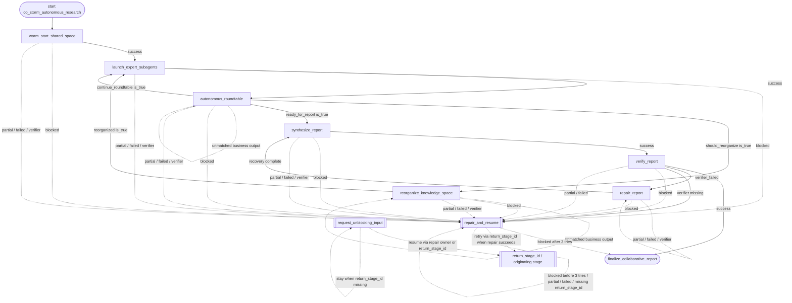

# co_storm_autonomous_research Flowchart

Developer-facing overview for `co_storm_autonomous_research`.

The Mermaid diagram shows the durable route; the table below explains what each stage does.

Global note: if `max_steps` is exceeded, the runtime may preempt normal business routing and emit the final step with degraded metadata; the final prompt must label the result as a partial handoff and must not claim that all gates passed.

## Stage Responsibilities

| Stage | Does | Produces | Done when |
|---|---|---|---|
| `warm_start_shared_space` | Create the initial shared conceptual space for autonomous research: diverse expert roles, grounded background evidence, an initial topic map, and a coverage baseline. | initial expert roster with stable expert identifiers, perspective-guided research transcript, evidence registry, and seeded knowledge map | At least two complementary expert perspectives are recorded. The warm-start transcript contains grounded research turns. The knowledge-map summary and coverage baseline are non-empty. The evidence registry contains stable citation identifiers and source locators. The shared space is ready for autonomous roundtable rotation. |
| `launch_expert_subagents` | Collect one grounded result and one distinct artifact for every expert before the Moderator makes a routing decision. | one grounded result and one distinct artifact for each expert | expert_results contains one result for every expert in expert_roster. Every result has a non-empty grounded summary and a distinct artifact. expert_round_index is exactly one greater than the last completed Moderator round. The complete expert result set is ready for Moderator synthesis. |
| `autonomous_roundtable` | Advance the autonomous roundtable by exactly one moderated turn, preserving the shared transcript and evidence while deciding whether to continue, reorganize the knowledge map, or synthesize the report. | one Moderator synthesis turn over independent expert-subagent results, updated evidence and coverage, and an exclusive routing decision | Exactly one new grounded turn is added to the transcript. The evidence registry and coverage map are carried forward or expanded. round_index increases by one and remains within the configured autonomous budget. round_decision and its boolean routing flags are mutually consistent. The turn is ready for a continue, reorganize, or report transition. |
| `reorganize_knowledge_space` | Reorganize the shared knowledge map after a moderator-selected threshold so later expert turns can target gaps without losing evidence provenance. | expanded, deduplicated, and coverage-aware knowledge-map summary | The knowledge-map summary is materially updated or explicitly confirmed coherent. Evidence provenance is preserved while redundant or unsupported branches are cleaned. Coverage gaps remain visible for the next roundtable turn. reorganization_count increases by one. |
| `synthesize_report` | Turn the reorganized shared knowledge space into a coherent report whose outline follows the map and whose claims remain traceable to the evidence registry. | structured report artifact with sections, inline citations, and a report summary | A report artifact exists. The report has a clear outline with at least two substantive sections. Inline numeric citations refer to the carried-forward evidence registry. The report is ready for an independent quality and citation gate. |
| `verify_report` | Apply the final deterministic quality gate to the generated report and prove that its citations and sections are grounded in the shared evidence registry. | independent report quality verdict, citation coverage summary, and repair findings if needed | The report is read and checked against the evidence registry and coverage map. quality_verdict is pass only when citation and section gates are satisfied. Quality findings and the citation coverage summary are recorded. The report is explicitly marked ready for finalization or repair. |
| `repair_report` | Translate report-audit findings into concrete repair actions so the report can be regenerated and rechecked without changing the research scope. | concrete report repair actions and a repaired-report handoff | The available audit or repair context is translated into concrete repair actions. The repair handoff is ready for the report synthesis stage. No unsupported new facts are introduced during repair. |
| `finalize_collaborative_report` | Finalize the autonomous Co-STORM research handoff. If {{report_path}} exists, {{quality_verdict}} is pass, and {{report_ready}} is true, return the validated report and include its summary ({{report_summary}}) and citation coverage ({{citation_coverage_summary}}). Otherwise, state that this is a partial handoff, do not claim validation, and include the available findings ({{quality_findings}}), repair summary ({{report_repair_summary}}), repair actions ({{repair_actions}}), and citation coverage ({{citation_coverage_summary}}). | Final workflow summary or handoff artifact. | Previous business stage completed successfully. |

## Maintenance Notes

- Keep this diagram aligned with `policy.py` and `graphbuilder_runtime.py`.
- If you add non-linear business gates, update `policy.py` and this diagram together.
- Keep repetitive repair edges summarized unless repair policy is the workflow's core behavior.
