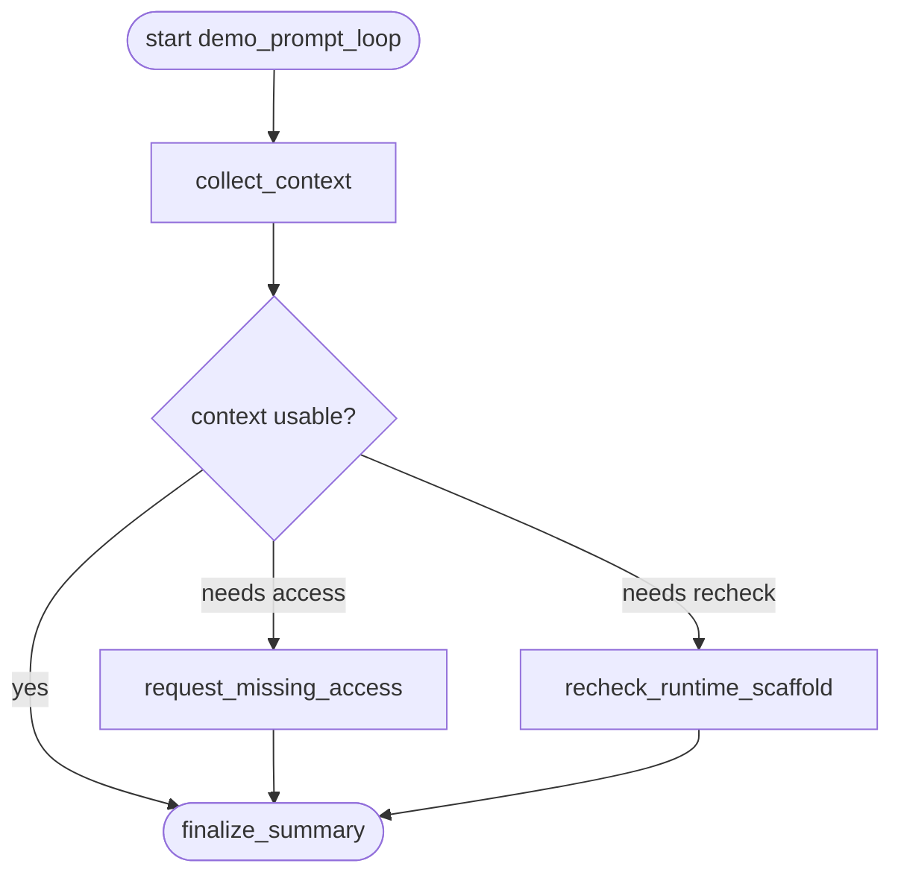

# demo_prompt_loop Flowchart

Developer-facing overview for `demo_prompt_loop`.

Derived from:

- `policy.py`
- `graphbuilder_runtime.py`

This document is informational only. `policy.py` remains the runtime source of
truth, and host agents must not choose branches from this diagram.

## Global Flow

## Policy Notes

- The workflow is intentionally tiny: collect context, optionally repair the
  context report, then finalize.
- `blocked` routes to `request_missing_access`.
- verifier failure routes to `recheck_runtime_scaffold`.
- `request_missing_access` and `recheck_runtime_scaffold` both converge on the
  final summary.
