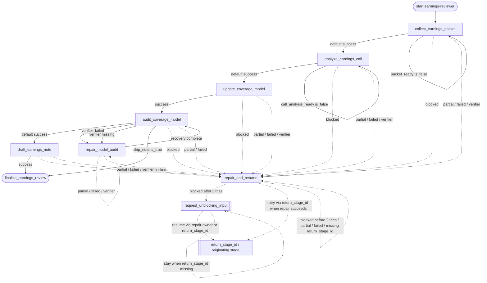

# earnings-reviewer Flowchart

Developer-facing overview for `earnings-reviewer`.

The Mermaid diagram shows the durable route; the table below explains what each stage does.

Global note: if `max_steps` is exceeded, this workflow terminates at the final step with `terminal_reason=max_steps_exceeded` and degraded metadata; it does not enter repair because the runtime budget is exhausted, and the final prompt must not claim delivery completion from that branch.

Recovery output note: a successful `request_unblocking_input` must include meaningful `blocking_reason` and `user_action_needed` values; a successful `repair_and_resume` must include `retry_reason`, `retry_notes`, and at least one meaningful `repair_actions` entry. Missing or malformed recovery output stays on its recovery node.

## Stage Responsibilities

| Stage | Does | Produces | Done when |
|---|---|---|---|
| `collect_earnings_packet` | Assemble a complete, dated earnings packet for the covered ticker and reporting period before analysis or model work starts. | earnings packet with reported actuals, consensus, filings, and the full call transcript | Reported actuals, consensus, filings inventory, and the full transcript locator are recorded. The earnings packet path is recorded under out/. skip_note is echoed as a boolean. The packet is ready for call analysis. |
| `analyze_earnings_call` | Turn the full earnings packet and transcript into a sourced call read that can drive the model update. | call analysis covering beat/miss, guidance, tone, dodged questions, and thesis impact | Headline read, beat/miss summary, guidance changes, tone, and dodged questions are recorded. Thesis impact is recorded. The call analysis is ready for the coverage-model update. |
| `update_coverage_model` | Drop sourced actuals into the coverage model, revise estimates, and produce the required variance table before model QC. | updated coverage model, variance table, and estimate-change summary | The updated coverage model path is recorded under out/. The variance table covers Revenue, GM, EBITDA, and EPS versus consensus and prior estimate. Estimate changes and thesis-change/handoff flags are recorded. skip_note is echoed. |
| `audit_coverage_model` | Prove the updated coverage model is internally consistent before the post-earnings note is drafted or staged. | model-scope Excel audit with no unresolved critical findings | A model-scope audit summary is recorded. Critical findings are absent or marked resolved. skip_note is echoed. The model is ready for note drafting or final staging. |
| `repair_model_audit` | Clear the recorded coverage-model audit failures so the model-scope audit can be re-run. | repaired coverage model ready to re-run the model-scope audit | Repair actions against the recorded audit findings are listed. The coverage model can be re-audited. |
| `draft_earnings_note` | Draft a tight post-earnings note that a senior analyst can mark up, including the variance table and the call read. | staged post-earnings note draft with variance table and call read | The staged note path is recorded under out/. The note headline and variance table are present. published_externally is false. |
| `finalize_earnings_review` | Stage the earnings-review drafts for senior-analyst sign-off and stop. Summarize {{ticker}} {{reporting_period}}, skip_note={{skip_note}}, the updated model at {{updated_model_path}}, the note at {{note_path}} if present (omit note claims when skip_note is true), the variance takeaway from {{estimate_change_summary}}, remaining unsourced flags {{unsourced_flags}}, audit {{audit_summary}}, call read {{call_analysis_summary}}, and any model-builder handoff {{handoff_target}} / {{handoff_reason}}. Do not publish, send, or recommend a trade. | Final workflow summary or handoff artifact. | Previous business stage completed successfully. |

## Maintenance Notes

- Keep this diagram aligned with `policy.py` and `graphbuilder_runtime.py`.
- If you add non-linear business gates, update `policy.py` and this diagram together.
- Keep repetitive repair edges summarized unless repair policy is the workflow's core behavior.
