# ios_ai_assisted_development_flow Flowchart

Developer-facing overview for `ios_ai_assisted_development_flow`.

The Mermaid diagram shows the durable route; the table below explains what each stage does.

```mermaid
flowchart TD
    start([start ios_ai_assisted_development_flow]) --> run_brainstorming[run_brainstorming]
    run_brainstorming -->|success| approve_subagent_review[approve_subagent_review]
    approve_subagent_review -->|default success| run_spec_review[run_spec_review]
    run_spec_review -->|default success| write_implementation_plan[write_implementation_plan]
    write_implementation_plan -->|default success| execute_implementation[execute_implementation]
    execute_implementation -->|default success| run_agentic_release_qa[run_agentic_release_qa]
    run_agentic_release_qa -->|default success| request_pre_merge_code_review[request_pre_merge_code_review]
    request_pre_merge_code_review -->|default success| verify_completion[verify_completion]
    verify_completion -->|default success| finalize_delivery_summary([finalize_delivery_summary])
    run_brainstorming -->|verifier_failed| run_brainstorming[run_brainstorming]
    run_brainstorming -->|verifier missing| repair_loop
    approve_subagent_review -->|verifier missing| repair_loop
    approve_subagent_review -->|subagent_review_approved is_false| finalize_delivery_summary([finalize_delivery_summary])
    run_spec_review -->|verifier_failed| run_spec_review[run_spec_review]
    run_spec_review -->|verifier missing| repair_loop
    run_spec_review -->|ready_for_planning is_false| run_brainstorming[run_brainstorming]
    write_implementation_plan -->|verifier missing| repair_loop
    write_implementation_plan -->|ready_for_implementation is_false| write_implementation_plan[write_implementation_plan]
    execute_implementation -->|verifier missing| repair_loop
    execute_implementation -->|plan_updates_required is_true| write_implementation_plan[write_implementation_plan]
    execute_implementation -->|tasks_completed is_false| execute_implementation[execute_implementation]
    execute_implementation -->|verification_passed is_false| write_implementation_plan[write_implementation_plan]
    run_agentic_release_qa -->|verifier missing| repair_loop
    run_agentic_release_qa -->|release_qa_verdict equals do_not_ship| execute_implementation[execute_implementation]
    request_pre_merge_code_review -->|verifier missing| repair_loop
    request_pre_merge_code_review -->|changes_requested is_true| execute_implementation[execute_implementation]
    verify_completion -->|verifier_failed| execute_implementation[execute_implementation]
    verify_completion -->|verifier missing| repair_loop
    verify_completion -->|verification_passed is_false| execute_implementation[execute_implementation]
    unblock_loop[[request_unblocking_input]]
    repair_loop[[repair_and_resume]]
    resume_target[[return_stage_id / originating stage]]
    run_brainstorming -.->|blocked| repair_loop
    run_brainstorming -.->|partial / failed| repair_loop
    approve_subagent_review -.->|blocked| repair_loop
    approve_subagent_review -.->|partial / failed / verifier| repair_loop
    run_spec_review -.->|blocked| repair_loop
    run_spec_review -.->|partial / failed| repair_loop
    write_implementation_plan -.->|blocked| repair_loop
    write_implementation_plan -.->|partial / failed / verifier| repair_loop
    execute_implementation -.->|blocked| repair_loop
    execute_implementation -.->|partial / failed / verifier| repair_loop
    run_agentic_release_qa -.->|blocked| repair_loop
    run_agentic_release_qa -.->|partial / failed / verifier| repair_loop
    request_pre_merge_code_review -.->|blocked| repair_loop
    request_pre_merge_code_review -.->|partial / failed / verifier| repair_loop
    verify_completion -.->|blocked| repair_loop
    verify_completion -.->|partial / failed| repair_loop
    unblock_loop -.->|resume via repair owner or return_stage_id| resume_target
    unblock_loop -.->|stay when return_stage_id missing| unblock_loop
    repair_loop -.->|blocked after 3 tries| unblock_loop
    repair_loop -.->|retry via return_stage_id when repair succeeds| resume_target
    repair_loop -.->|blocked before 3 tries / partial / failed / missing return_stage_id| repair_loop
```

Global note: if `max_steps` is exceeded, this workflow terminates at the final step with `terminal_reason=max_steps_exceeded` and degraded metadata; it does not enter repair because the runtime budget is exhausted, and the final prompt must not claim delivery completion from that branch.

Recovery output note: a successful `request_unblocking_input` must include meaningful `blocking_reason` and `user_action_needed` values; a successful `repair_and_resume` must include `retry_reason`, `retry_notes`, and at least one meaningful `repair_actions` entry. Missing or malformed recovery output stays on its recovery node.

## Stage Responsibilities

| Stage | Does | Produces | Done when |
|---|---|---|---|
| `run_brainstorming` | Turn the user's development goal into clarified requirements and a written brainstorming design document before spec review, planning, or implementation work begins. | a brainstorming design package with a written design document path that is ready for subagent review authorization | Clarification questions and answer summary are recorded. The brainstorming design direction and rationale are recorded. The brainstorming design document exists under docs/superpowers/specs/ and its path is included. UI-impacting requests include implementation-ready visual detail and visual QA comparison inputs in the brainstorming design document. The brainstorming design package is ready for an explicit subagent review authorization decision. |
| `approve_subagent_review` | Ask the user for explicit permission to launch the required subagent-backed design review pass before implementation planning begins. | an explicit user authorization decision for the required subagent design review | The user has explicitly approved or declined the required subagent design review pass. The authorization decision is summarized for the next stage or workflow closeout. |
| `run_spec_review` | Run the required independent development, design, and testing subagent review loop on the design package and produce concrete review evidence before implementation planning. | a review-complete design package with concrete subagent review artifacts and implementation-planning readiness | Concrete review artifacts from the development, design, and testing subagent reviews are handed in. The spec review loop has completed with independent development, design, and testing perspective reviews. Implementation-planning readiness or required design rework is recorded. |
| `write_implementation_plan` | Turn the design package into a concrete superpowers implementation plan, incorporate any replanning feedback, and prepare a plan that can move directly into implementation. | implementation plan document and recorded subagent-driven execution mode ready for implementation | The implementation plan exists under docs/superpowers/plans/. The plan summary is recorded. The execution mode is recorded as subagent-driven and is ready for implementation. |
| `execute_implementation` | Execute the approved superpowers plan and leave the change ready for pre-merge code review. | implemented plan tasks with verification evidence and any required planning follow-up | All selected implementation tasks are complete or the remaining blocked tasks are reported. Changed files are summarized. Verification commands and outcomes are reported. Any debugging or plan-update requirement is summarized explicitly. |
| `run_agentic_release_qa` | Run a release QA pass after implementation verification and before pre-merge code review so regressions are caught before delivery closes. | change-aware release QA verdict with executed checks, blocked checks, and risk-based next steps | The QA pass identifies the code range or artifact under test. Change-derived release risks are summarized. Executed checks and blocked checks are reported separately. The release QA verdict is ship or do_not_ship when the stage completes successfully. A ship verdict means there are no blocked checks left in the QA result. Risk-based next steps are listed. |
| `request_pre_merge_code_review` | Review the current local diff or branch state after implementation and release QA, before merge or MR creation, and return a merge-readiness decision. | pre-merge code review findings and merge-readiness decision for the current local diff | Review snapshot is identified. Findings are grouped by severity or explicitly reported as none. An approved review means no actionable findings remain. The review status is approved or changes_requested when the stage completes successfully. |
| `verify_completion` | Run a final evidence-before-claims verification pass after pre-merge review and before the workflow summarizes completion. | fresh completion verification evidence proving the workflow is ready to claim success | Fresh completion verification evidence is recorded. Verification clearly reports whether completion can be claimed. Remaining risks are listed when verification completes without passing. |
| `finalize_delivery_summary` | /verification-before-completion finalize the AI-assisted development delivery summary using {{design_summary}}, {{design_path}}, {{plan_summary}}, {{plan_path}}, {{implementation_summary}}, {{release_qa_verdict}}, {{review_status}}, {{reviewed_snapshot}}, {{completion_verification_passed}}, {{completion_verification_summary}}, {{completion_verification_evidence}}, {{completion_remaining_risks}}, {{subagent_review_approved}}, {{authorization_summary}}, and {{terminal_reason}} as branch-aware completion inputs. Empty fields for stages not reached are intentional and mean that evidence was not produced.  Stage Context:  - Design summary: {{design_summary}} - Design path: {{design_path}} - Plan summary: {{plan_summary}} - Plan path: {{plan_path}} - Implementation summary: {{implementation_summary}} - Release QA verdict: {{release_qa_verdict}} - Release QA executed checks: {{release_qa_executed_checks}} - Release QA blocked checks: {{release_qa_blocked_checks}} - Release QA risk next steps: {{release_qa_risk_next_steps}} - Release QA artifacts: {{release_qa_artifacts}} - Review status: {{review_status}} - Reviewed snapshot: {{reviewed_snapshot}} - Review findings: {{review_findings}} - Completion verification passed: {{completion_verification_passed}} - Completion verification summary: {{completion_verification_summary}} - Completion verification evidence: {{completion_verification_evidence}} - Completion remaining risks: {{completion_remaining_risks}} - Subagent review authorization: {{subagent_review_approved}} - Authorization summary: {{authorization_summary}} - Terminal reason: {{terminal_reason}} - Branch input rule: a blank field means its stage was not reached or the evidence is not applicable; report it as not executed rather than inferring success.  Stage Boundaries:  - If subagent review authorization was declined, report that the workflow closed before implementation planning; do not claim delivery completion or invent implementation evidence. - If terminal reason is max_steps_exceeded, label the result as a degraded terminal summary and do not claim that delivery completion was proven. - If a stage was not reached because authorization was declined or the budget was exhausted, summarize only the evidence available on that branch and omit normal-delivery claims. - For the normal delivery branch, do not claim completion unless completion verification passed, release QA ended in ship, and pre-merge review ended in approved. - Do not invent new implementation, QA, review, or verification facts that are not already grounded in the recorded workflow state. - Keep the final summary concise and evidence-based so the user can reuse it as a handoff artifact.  Blocked Conditions:  - Block if the final completion evidence is missing or inconsistent for a normal delivery claim. - Block if the workflow cannot produce a grounded final handoff summary from the recorded state. | Final workflow summary or handoff artifact. | Previous business stage completed successfully. |

## Maintenance Notes

- Keep this diagram aligned with `policy.py` and `graphbuilder_runtime.py`.
- If you add non-linear business gates, update `policy.py` and this diagram together.
- Keep repetitive repair edges summarized unless repair policy is the workflow's core behavior.
