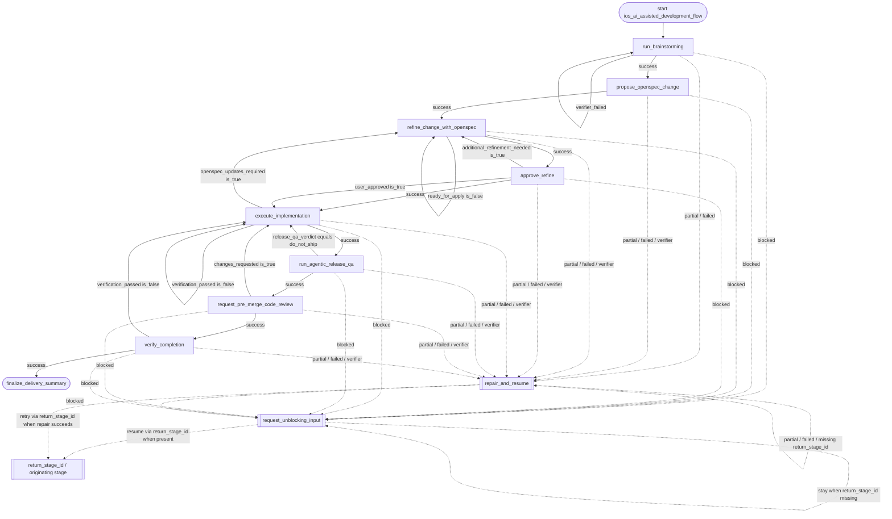

# ios_ai_assisted_development_flow Flowchart

Developer-facing overview for `ios_ai_assisted_development_flow`.

The Mermaid diagram shows the durable route; the table below explains what each stage does.

Global note: if `max_steps` is exceeded, runtime policy preempts normal business routing and sends the workflow to `request_unblocking_input` while preserving `return_stage_id`.

## Stage Responsibilities

| Stage | Does | Produces | Done when |
|---|---|---|---|
| `run_brainstorming` | Turn the user's iOS Client development goal into clarified requirements and an approved design before OpenSpec or implementation work begins. | clarified requirements, approved brainstorming design document, and design document path | Clarification questions and answer summary are recorded. The user-approved design direction is recorded. The approved brainstorming design document exists under docs/superpowers/specs/ and its path is included. UI-impacting requests include implementation-ready visual detail and visual QA comparison inputs in the approved design document. The spec review loop has completed with independent development, design, and testing perspective reviews. |
| `propose_openspec_change` | Create the OpenSpec change artifacts that make the approved design durable and implementation-ready. | OpenSpec proposal, design/spec, and tasks ready for implementation | The OpenSpec change directory exists. Proposal, design/spec, and tasks artifacts are identified. The change artifacts are formalized and the current apply-readiness is reported. Artifact completeness is explicit enough to know whether proposal, design/spec, and tasks are all present. |
| `refine_change_with_openspec` | /openspec-explore {{change_name}} | refined OpenSpec artifacts ready for task execution | At least one exploratory conversation turn has occurred with the user. Risks, ambiguities, and open questions have been surfaced and discussed. The conversation evidence is summarized instead of jumping straight to structured output. Unresolved questions are documented (even if empty, with user confirmation). The change is confirmed ready for apply after conversation. |
| `approve_refine` | Show the user what the OpenSpec refinement found, and get explicit approval before proceeding to implementation. | user approval to proceed from refinement to implementation | The user has reviewed the refinement summary. The user has explicitly approved implementation or requested another refinement pass. |
| `execute_implementation` | Execute the pending OpenSpec tasks and leave the change ready for pre-merge code review. | completed OpenSpec task implementation with verification evidence | All selected OpenSpec implementation tasks are complete or the remaining blocked tasks are reported. Changed files are summarized. Verification commands and outcomes are reported. |
| `run_agentic_release_qa` | Run a release QA pass after implementation verification and before pre-merge code review so regressions are caught before delivery closes. | change-aware release QA verdict with executed checks, blocked checks, and risk-based next steps | The QA pass identifies the code range or artifact under test. Change-derived release risks are summarized. Executed checks and blocked checks are reported separately. The release QA verdict is ship, ship_with_risks, do_not_ship, or blocked. Risk-based next steps are listed. |
| `request_pre_merge_code_review` | Review the current local diff or branch state after implementation and release QA, before merge or MR creation, and return a merge-readiness decision. | pre-merge code review findings and merge-readiness decision for the current local diff | Review snapshot is identified. Findings are grouped by severity or explicitly reported as none. The review status is approved, changes_requested, or blocked. |
| `verify_completion` | Run a final evidence-before-claims verification pass after pre-merge review and before the workflow summarizes completion. | fresh completion verification evidence proving the workflow is ready to claim success | Fresh completion verification evidence is recorded. Verification clearly reports whether completion can be claimed. Remaining risks or missing verification inputs are listed when verification does not pass. |
| `finalize_delivery_summary` | Prepare the final iOS Client AI-assisted development delivery summary using approved design summary {{approved_design_summary}}, approved design path {{approved_design_path}}, proposal path {{proposal_path}}, OpenSpec design path {{openspec_design_path}}, tasks path {{tasks_path}}, spec paths {{spec_paths}}, implementation summary {{implementation_summary}}, changed files {{changed_files}}, verification commands {{verification_commands}}, release QA verdict {{release_qa_verdict}}, release QA summary {{release_qa_summary}}, release QA executed checks {{release_qa_executed_checks}}, release QA blocked checks {{release_qa_blocked_checks}}, release QA risk next steps {{release_qa_risk_next_steps}}, release QA artifacts {{release_qa_artifacts}}, review status {{review_status}}, reviewed snapshot {{reviewed_snapshot}}, review summary {{review_summary}}, review findings {{review_findings}}, completion verification passed {{completion_verification_passed}}, completion verification summary {{completion_verification_summary}}, completion verification evidence {{completion_verification_evidence}}, completion verification missing inputs {{completion_missing_verification_inputs}}, completion remaining risks {{completion_remaining_risks}}, release QA risks resolved {{completion_release_qa_risks_resolved}}, release QA risk resolution summary {{completion_release_qa_risk_resolution_summary}}, open issues {{open_issues}}, and remaining risks. | Final workflow summary or handoff artifact. | Previous business stage completed successfully. |

## Maintenance Notes

- Keep this diagram aligned with `policy.py` and `graphbuilder_runtime.py`.
- If you add non-linear business gates, update `policy.py` and this diagram together.
- Keep repetitive repair edges summarized unless repair policy is the workflow's core behavior.
