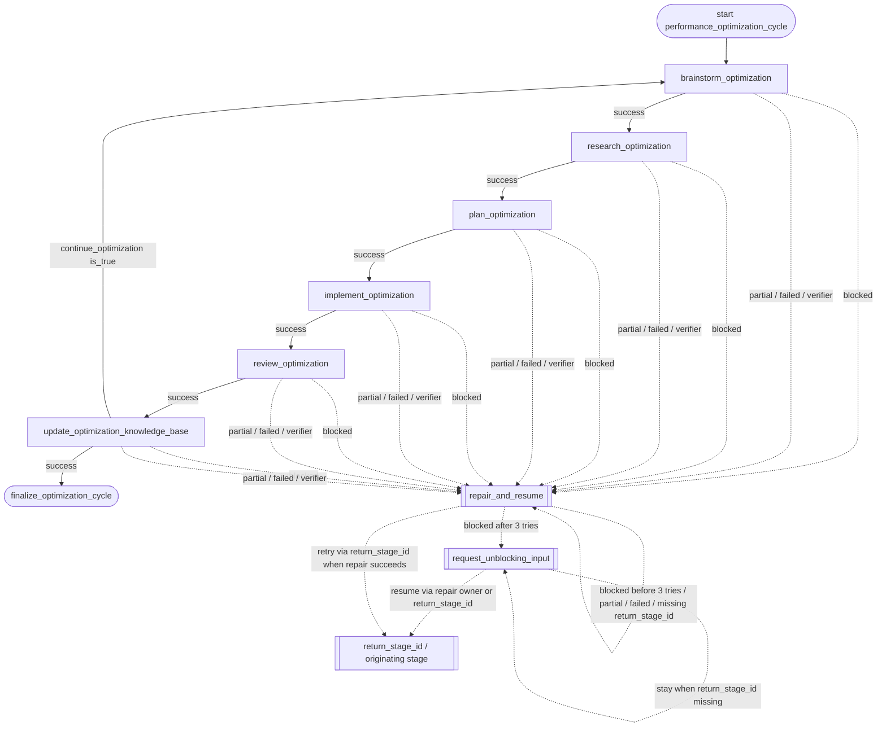

# performance_optimization_cycle Flowchart

Developer-facing overview for `performance_optimization_cycle`.

The Mermaid diagram shows the durable route; the table below explains what each stage does.

Global note: if `max_steps` is exceeded, runtime policy preempts normal business routing and sends the workflow to `repair_and_resume`; that shared repair stage may escalate to `request_unblocking_input` only after 3 blocked self-repair attempts while preserving `return_stage_id`.

## Stage Responsibilities

| Stage | Does | Produces | Done when |
|---|---|---|---|
| `brainstorm_optimization` | Establish the next optimization hypothesis, measurable success criteria, and scored ideation artifact without changing implementation code. | scored optimization-hypothesis shortlist and ideation artifact | At least one testable hypothesis is recorded. Success criteria and a scored ideation artifact path are recorded. The work is ready for evidence gathering. |
| `research_optimization` | Turn the selected hypothesis into traceable technical evidence suitable for an implementation plan. | research brief and evidence map for the selected hypothesis | A research brief path and evidence summary are recorded. Implementation risks and open questions are explicit. |
| `plan_optimization` | Produce a concrete, test-first plan that turns validated research into a bounded implementation change. | test-first implementation plan for the selected optimization | An implementation plan path is recorded. The plan names the submission-test verification command. |
| `implement_optimization` | Implement the planned optimization and prove correctness with the repository submission tests. | implemented candidate with submission-test evidence | The implemented change and changed paths are recorded. python tests/submission_tests.py has passed. |
| `review_optimization` | Review correctness, performance evidence, and compliance with the optimization constraints before knowledge-base maintenance. | review findings and acceptance decision for the optimized kernel | Review findings and a readiness decision are recorded. |
| `update_optimization_knowledge_base` | Persist the evidence, implementation outcome, and review decision in the repository knowledge base, then make an explicit next-cycle decision. | updated durable knowledge-base record and next-cycle decision | The updated knowledge-base artifacts and update summary are recorded. The workflow explicitly decides whether to start another optimization iteration. |
| `finalize_optimization_cycle` | Summarize the completed optimization cycle, including its hypothesis, evidence, implementation verification, review result, knowledge-base artifacts, and the reason no further iteration is scheduled. | Final workflow summary or handoff artifact. | Previous business stage completed successfully. |

## Maintenance Notes

- Keep this diagram aligned with `policy.py` and `graphbuilder_runtime.py`.
- If you add non-linear business gates, update `policy.py` and this diagram together.
- Keep repetitive repair edges summarized unless repair policy is the workflow's core behavior.
