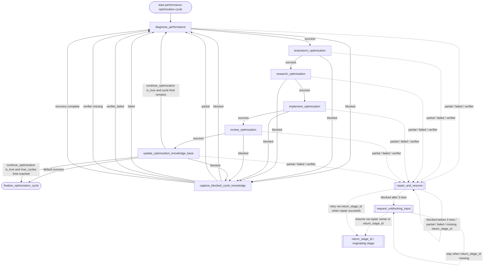

# performance-optimization-cycle Flowchart

Developer-facing overview for `performance-optimization-cycle`.

The Mermaid diagram shows the durable route; the table below explains what each stage does.

Global note: if `max_steps` is exceeded, the runtime may preempt normal business routing and emit the final step with degraded metadata; the final prompt must label the result as a partial handoff and must not claim that all gates passed.

## Stage Responsibilities

| Stage | Does | Produces | Done when |
|---|---|---|---|
| `diagnose_performance` | Produce a measurable baseline and a prioritized bottleneck diagnosis before optimization hypotheses are generated. | performance baseline, bottleneck summary, and diagnostic report | Baseline metrics and their measurement context are recorded. A dominant bottleneck and a diagnostic report path are recorded. The diagnosis is ready to constrain hypothesis generation. |
| `brainstorm_optimization` | Establish the next optimization hypothesis, measurable success criteria, and scored ideation artifact without changing implementation code. | scored optimization-hypothesis shortlist and ideation artifact | At least one testable hypothesis is recorded. Success criteria and a scored ideation artifact path are recorded. The work is ready for evidence gathering. |
| `research_optimization` | Turn the selected hypothesis into traceable technical evidence, a bounded change summary, and a verification plan for implementation. | research brief, implementation-ready change summary, verification plan, and evidence map | A research brief path, evidence summary, implementation-ready change summary, and verification plan are recorded. Implementation risks and open questions are explicit. |
| `implement_optimization` | Implement the planned optimization and prove correctness with the repository submission tests. | implemented candidate with submission-test evidence | The smallest testable change and verification commands are recorded. The implemented change and changed paths are recorded. python tests/submission_tests.py has passed. |
| `review_optimization` | Review correctness, performance evidence, and compliance with the optimization constraints before knowledge-base maintenance. | review findings and acceptance decision for the optimized kernel | Review findings and a readiness decision are recorded. |
| `update_optimization_knowledge_base` | Persist the evidence, implementation outcome, and review decision in the repository knowledge base, then make an explicit next-cycle decision. | updated durable knowledge-base record and next-cycle decision | The updated knowledge-base artifacts and update summary are recorded. The workflow explicitly decides whether to start another optimization iteration. |
| `capture_blocked_cycle_knowledge` | Persist the blocker and any usable evidence as a concise durable learning record, so the next optimization cycle starts without asking the user to unblock this one. | durable knowledge-base record of the blocked stage and its next-cycle learning | A concise record of the blocked stage, blocker, evidence, and next-cycle lead is written to the knowledge base. The workflow is ready to begin a fresh performance diagnosis without waiting for user input. |
| `finalize_optimization_cycle` | Summarize the optimization handoff, including its hypothesis, evidence, implementation verification, review result, knowledge-base artifacts, and why no further iteration is scheduled. If {{degraded}} is true or {{terminal_reason}} is max_steps_exceeded, explicitly label the result partial and do not claim that the optimization cycle completed or passed all gates. Include whether another iteration was requested ({{continue_optimization}}) and the configured cycle limit ({{max_cycles}}). | Final workflow summary or handoff artifact. | Previous business stage completed successfully. |

## Maintenance Notes

- Keep this diagram aligned with `policy.py` and `graphbuilder_runtime.py`.
- If you add non-linear business gates, update `policy.py` and this diagram together.
- Keep repetitive repair edges summarized unless repair policy is the workflow's core behavior.
